# Tutorial 3: WebChat using Yew
 
Pada tutorial ini, saya membangun aplikasi **WebChat berbasis browser** menggunakan **Yew** — framework frontend Rust yang dikompilasi ke WebAssembly (WASM). Berbeda dari tutorial sebelumnya yang berbasis konsol, kini komunikasi real-time dilakukan melalui tampilan grafis di browser.
 
Referensi utama: [Let's Build a WebSockets Project with Rust and Yew 0.19](https://blog.devgenius.io/lets-build-a-websockets-project-with-rust-and-yew-0-19-60720367399f)
 
---
 
## Experiment 3.1: Original Code
 
### Deskripsi
 
Pada bagian ini, saya mempelajari dan menjalankan dua repositori:
 
1. **YewChat** — client WebChat yang ditulis dengan Rust/Yew, dikompilasi ke WASM
2. **SimpleWebsocketServer** — server WebSocket yang ditulis dengan Node.js/TypeScript
### Cara Menjalankan
 
**Server (JavaScript/TypeScript):**
```bash
cd SimpleWebsocketServer
npm install
npm start
# Server berjalan di ws://localhost:8080
```
 
**Client (Rust/Yew):**
```bash
cd YewChat
npm install
wasm-pack build --target web --out-dir pkg --release
npm start
# Aplikasi berjalan di http://localhost:8000
```
 
### Permasalahan yang Ditemui
 
Beberapa masalah muncul selama proses setup:
 
1. **`spawn EINVAL`** — Webpack plugin `@wasm-tool/wasm-pack-plugin` gagal memanggil subprocess di Windows. Solusi: nonaktifkan plugin di `webpack.config.js` dan jalankan `wasm-pack build` secara manual.
2. **`module.run_app is not a function`** — `bootstrap.js` memanggil fungsi yang tidak ter-export karena perbedaan API antara Yew 0.19 dan 0.21. Solusi: ubah `bootstrap.js` menjadi `import init from './pkg/yewchat.js'; init();` dan gunakan `#[wasm_bindgen(start)]` di Rust.
3. **Versi `wasm-bindgen` tidak kompatibel** — Versi lama tidak cocok dengan Rust terbaru. Solusi: update semua dependency di `Cargo.toml` ke versi terbaru.
4. **Pesan hanya tampil satu** — Closure di `use_effect_with` menutup nilai state yang lama sehingga setiap pesan baru menimpa yang lama. Solusi: gunakan `Rc<RefCell<Vec<ChatMessage>>>` agar closure selalu mengakses list pesan yang sama di memori.
### Hasil
 
Aplikasi berhasil dijalankan dengan tampilan login dan chat yang fungsional:
 
- Halaman login dengan input username
- Halaman chat dengan sidebar daftar user online
- Pesan real-time antara beberapa tab browser/user berbeda
> **Screenshoot:** 

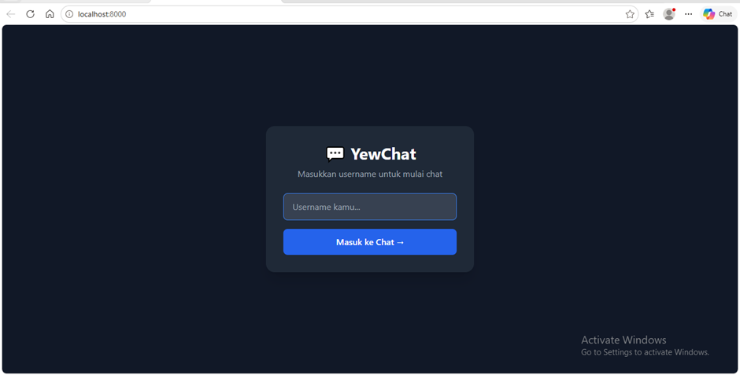

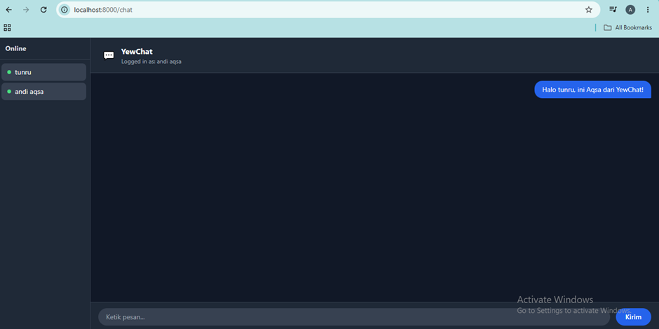

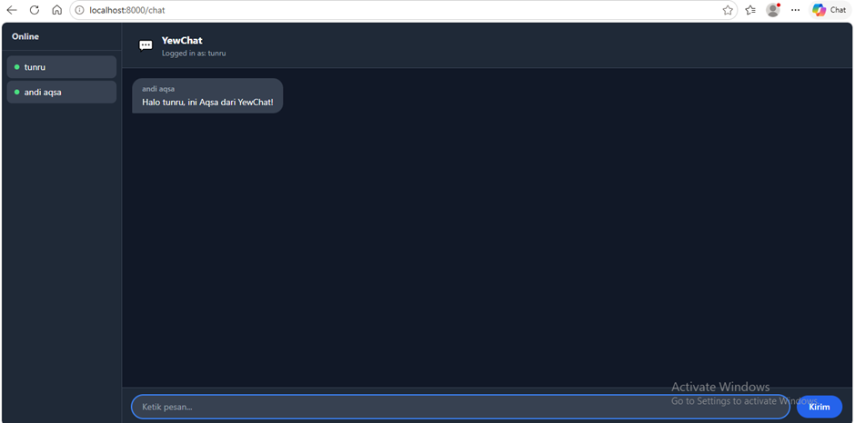

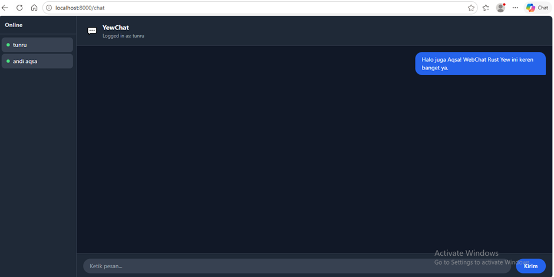

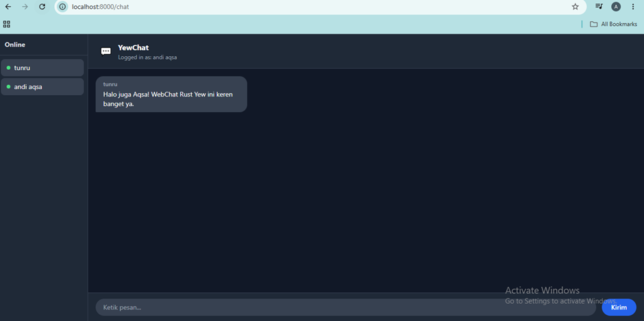

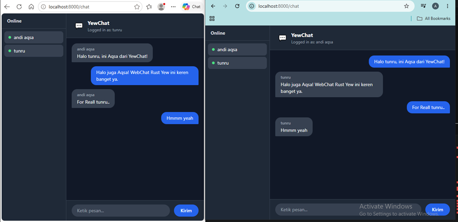
 
---


## Experiment 3.2: Be Creative!
 
### Deskripsi
 
Pada bagian ini, saya menambahkan berbagai kreativitas pada webclient untuk membuat pengalaman chat yang lebih menarik dan personal. Inspirasi dari pernyataan WEF bahwa kreativitas adalah kunci untuk bersaing di era AI dalam dunia kerja masa depan.
 
Referensi: [WEF — Creativity as Key Workforce Skill](https://www.weforum.org/agenda/2020/11/ai-automation-creativity-workforce-skill-fute-of-work/)
 
### Perubahan yang Dilakukan
 
**1. Desain UI Dark Mode Modern**
 
Tampilan dirancang ulang dengan tema gelap menggunakan Tailwind CSS. Warna utama biru-gelap (`gray-900`, `gray-800`) memberikan kesan profesional dan nyaman untuk mata saat digunakan lama.
 
**2. Halaman Login yang Elegan**
 
Halaman login dibuat dengan card terpusat di tengah layar, dilengkapi:
- Ikon emoji 💬 sebagai identitas visual aplikasi
- Teks sambutan dalam Bahasa Indonesia
- Input field dengan efek focus border biru
- Tombol "Masuk ke Chat →" dengan hover effect
**3. Sidebar Daftar User Online**
 
Sidebar kiri menampilkan daftar semua user yang sedang terhubung secara real-time, dengan:
- Indikator titik hijau (●) menandakan status online
- Update otomatis saat user bergabung atau keluar
**4. Bubble Chat Dua Arah**
 
Pesan dibedakan secara visual:
- **Pesan sendiri** — bubble biru, rata kanan, tanpa nama pengirim
- **Pesan orang lain** — bubble abu-abu gelap, rata kiri, dengan nama pengirim di atas
**5. Teks Antarmuka Bahasa Indonesia**
 
Semua teks UI menggunakan Bahasa Indonesia ("Ketik pesan...", "Kirim", "Logged in as", "Online") untuk pengalaman yang lebih personal dan lokal.
 
**6. Routing Halaman dengan Yew Router**
 
Menggunakan `yew-router` untuk navigasi SPA:
- `/` → halaman Login
- `/chat` → halaman Chat
- Username disimpan di `sessionStorage` dan diambil saat masuk halaman chat
### Penjelasan Teknis Kreativitas
 
Kreativitas pada bagian ini tidak hanya terbatas pada estetika visual, tetapi juga pada **arsitektur kode**. Saya memilih pendekatan yang bersih dengan memisahkan komponen ke dalam modul terpisah:
 
```
src/
  lib.rs              — entry point WASM
  components/
    mod.rs            — daftar modul
    app.rs            — routing utama
    login.rs          — halaman login
    chat.rs           — halaman chat
    types.rs          — struktur data pesan
```
 
Pemisahan ini membuat kode lebih mudah dibaca, diuji, dan dikembangkan — prinsip yang sama pentingnya dengan kreativitas visual dalam rekayasa perangkat lunak.
 
### Hasil
 
> **Screenshoot:** 

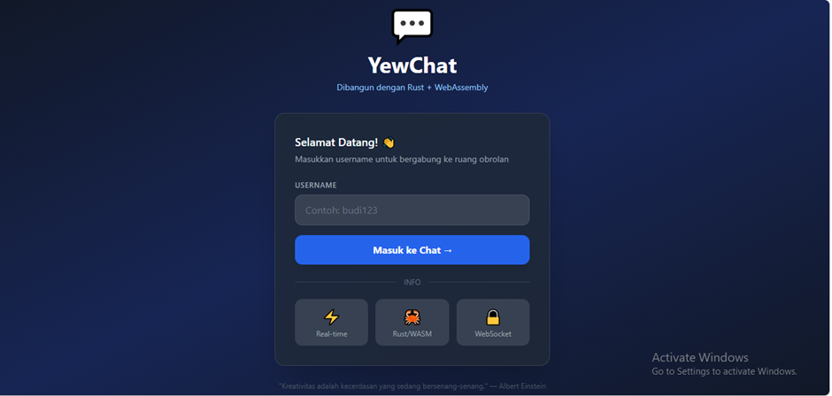

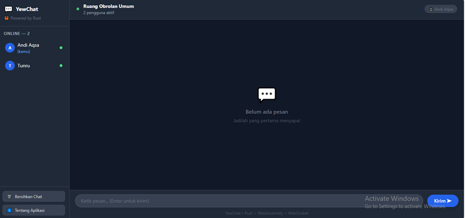

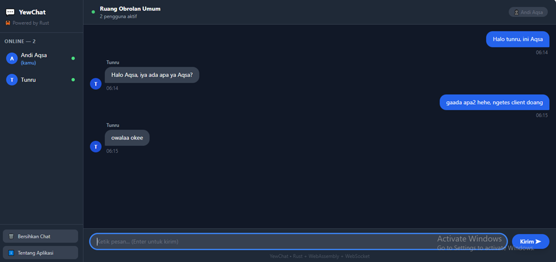

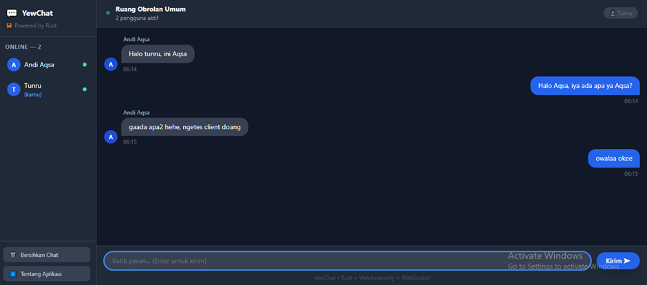

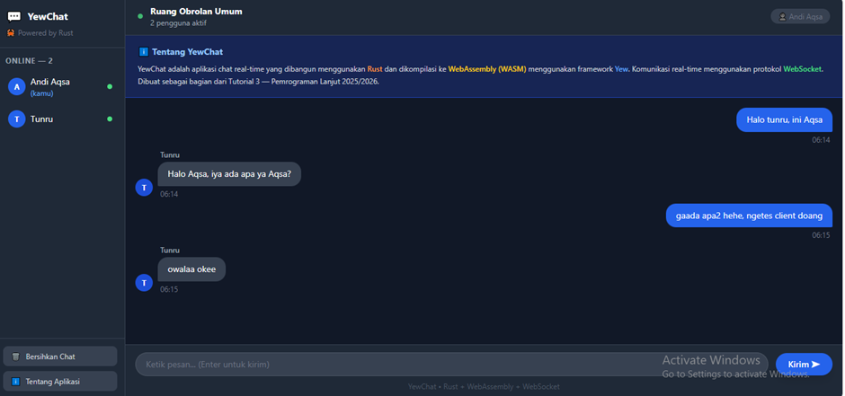
 
---

## Bonus: Rust WebSocket Server untuk YewChat
 
### Deskripsi
 
Server WebSocket original untuk YewChat ditulis dalam JavaScript/TypeScript (Node.js). Pada bagian bonus ini, saya mengganti server tersebut dengan server yang ditulis sepenuhnya dalam **Rust** menggunakan `tokio` dan `tokio-tungstenite`.
 
### Bagaimana Cara Melakukannya
 
**Memahami format pesan server JavaScript:**
 
Server JS menggunakan format JSON terstruktur dengan field `messageType`:
 
```json
// Client → Server: registrasi user
{"messageType": "register", "data": "username"}
 
// Client → Server: kirim pesan
{"messageType": "message", "data": "isi pesan"}
 
// Server → semua Client: daftar user
{"messageType": "users", "dataArray": ["user1", "user2"]}
 
// Server → semua Client: pesan chat
{"messageType": "message", "data": "{\"from\":\"user1\",\"message\":\"halo\",\"time\":1234567890}"}
```
 
**Insight penting:** Meskipun format di atas terlihat kompleks, semua pesan WebSocket pada dasarnya dikirim dan diterima sebagai **satu string teks**. JSON hanyalah format serialisasi — ia di-serialize menjadi string sebelum dikirim, dan di-deserialize kembali saat diterima. Inilah yang membuat server Rust dapat menanganinya dengan cara yang sama seperti server JS.
 
**Implementasi server Rust (`src/main.rs`):**
 
```rust
use tokio::net::TcpListener;
use tokio_tungstenite::accept_async;
use tokio::sync::broadcast;
use futures_util::{SinkExt, StreamExt};
use serde::{Deserialize, Serialize};
use std::collections::HashMap;
use std::sync::{Arc, Mutex};
 
#[derive(Deserialize)]
struct ClientMessage {
    #[serde(rename = "messageType")]
    message_type: String,
    #[serde(default)]
    data: String,
}
 
#[derive(Serialize, Clone)]
struct ServerMessage {
    #[serde(rename = "messageType")]
    message_type: String,
    #[serde(skip_serializing_if = "Option::is_none")]
    data: Option<String>,
    #[serde(rename = "dataArray", skip_serializing_if = "Option::is_none")]
    data_array: Option<Vec<String>>,
}
 
#[tokio::main]
async fn main() {
    let listener = TcpListener::bind("0.0.0.0:8080").await.unwrap();
    println!("Rust WebSocket Server berjalan di ws://localhost:8080");
 
    let (tx, _) = broadcast::channel::<String>(100);
    let users: Arc<Mutex<HashMap<String, String>>> = Arc::new(Mutex::new(HashMap::new()));
 
    loop {
        let (stream, addr) = listener.accept().await.unwrap();
        let tx = tx.clone();
        let rx = tx.subscribe();
        let users = users.clone();
 
        tokio::spawn(async move {
            // handle setiap koneksi client...
        });
    }
}
```
 
**Dependency `Cargo.toml`:**
 
```toml
[dependencies]
tokio = { version = "1", features = ["full"] }
tokio-tungstenite = "0.21"
futures-util = "0.3"
serde = { version = "1", features = ["derive"] }
serde_json = "1"
```
 
### Mengapa Perubahan Ini Berhasil
 
Perubahan berhasil karena beberapa alasan:
 
1. **WebSocket adalah protokol transport agnostik** — tidak peduli apakah server ditulis dalam JS, Rust, Python, atau bahasa lain, selama ia berbicara protokol WebSocket yang sama (RFC 6455), client tidak akan tahu perbedaannya.
2. **JSON adalah format teks biasa** — server tidak perlu tahu "makna" dari JSON yang dikirim. Ia cukup menerima string, memprosesnya sesuai `messageType`, dan meneruskan ke client lain. `serde_json` di Rust melakukan parse/serialize dengan cara yang identik dengan `JSON.parse()`/`JSON.stringify()` di JavaScript.
3. **Broadcast pattern yang sama** — baik server JS maupun Rust menggunakan pola yang sama: simpan semua koneksi aktif, saat ada pesan masuk, kirim ke semua koneksi yang terbuka. Di Rust, ini dilakukan dengan `tokio::sync::broadcast::channel`.
4. **YewChat client tidak berubah sama sekali** — client Yew tetap terhubung ke `ws://localhost:8080` dan mengirim/menerima format JSON yang sama. Penggantian server bersifat transparan.
### Perbandingan: JavaScript vs Rust WebSocket Server
 
| Aspek | JavaScript (Node.js) | Rust (Tokio) |
|---|---|---|
| **Performa** | Baik untuk I/O, single-threaded event loop | Sangat tinggi, multi-threaded async |
| **Keamanan memori** | Tidak ada, bergantung GC | Dijamin pada compile time |
| **Kemudahan setup** | Sangat mudah, ekosistem besar | Lebih kompleks, tapi tooling bagus |
| **Ukuran binary** | Node.js runtime besar | Binary kecil dan mandiri |
| **Error handling** | Runtime errors | Sebagian besar ditangkap saat compile |
| **Concurrency** | Event loop + callback/Promise | `async/await` + OS threads |
| **Waktu startup** | Cepat | Sangat cepat |
 
### Preferensi Pribadi
 
Saya lebih menyukai **server Rust** untuk alasan berikut:
 
**Keamanan dan keandalan** adalah prioritas utama dalam sistem komunikasi real-time. Rust memastikan tidak ada race condition atau memory leak melalui sistem ownership-nya — bug yang sering muncul di server JS yang berjalan lama (memory leak dari closure yang tidak di-cleanup, misalnya) tidak mungkin terjadi di Rust.
 
**Performa yang konsisten** — Rust tidak memiliki garbage collector, sehingga tidak ada jeda tiba-tiba (GC pause) yang bisa menyebabkan lag pada sistem chat dengan banyak pengguna.
 
**Namun**, untuk **prototyping cepat** dan tim yang sudah familiar dengan JavaScript, server JS tetap lebih praktis. Ekosistem npm yang besar dan kemudahan debugging membuat server JS lebih cepat untuk dikembangkan di awal.
 
Kesimpulannya: untuk **production dengan skala besar**, pilih Rust. Untuk **MVP atau proof of concept**, JavaScript sudah sangat memadai.
 
> **Screenshoot:**

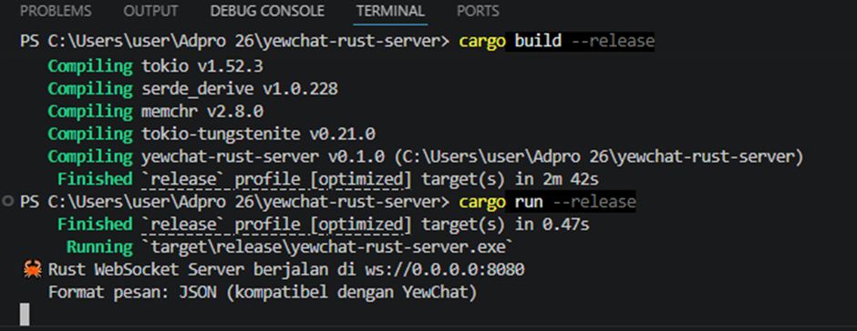

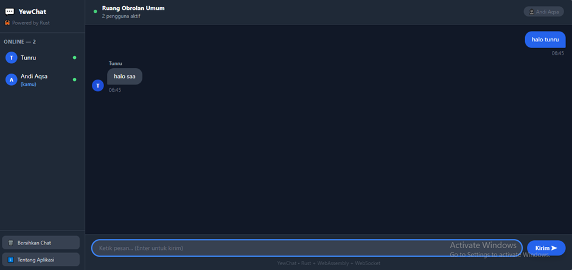

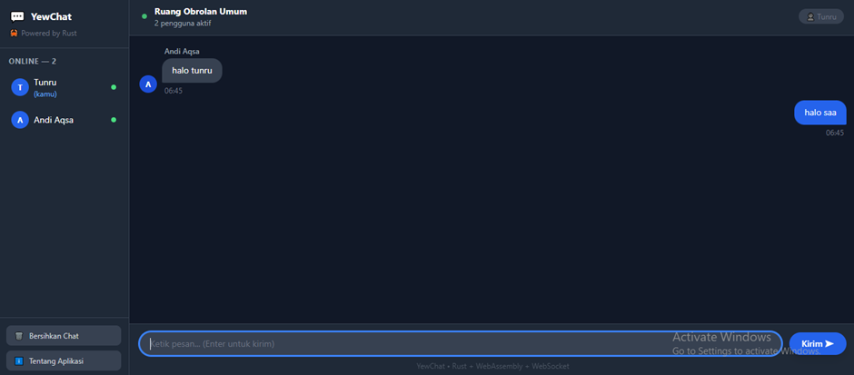

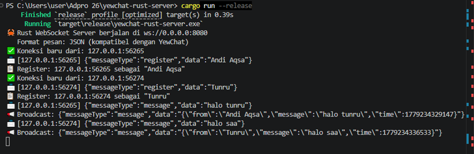
 
---
 
## Teknologi yang Digunakan
 
- **Rust** — bahasa pemrograman utama client
- **Yew 0.21** — framework frontend Rust (seperti React, tapi Rust)
- **WebAssembly (WASM)** — target kompilasi Rust untuk browser
- **wasm-pack** — tool untuk mengkompilasi Rust ke WASM
- **Tailwind CSS** — utility-first CSS framework untuk styling
- **WebSocket** — protokol komunikasi real-time dua arah
- **Node.js/TypeScript** — server WebSocket original (Experiment 3.1 & 3.2)
- **Tokio + tokio-tungstenite** — async runtime dan WebSocket library untuk server Rust (Bonus)
- **serde/serde_json** — serialisasi/deserialisasi JSON di Rust